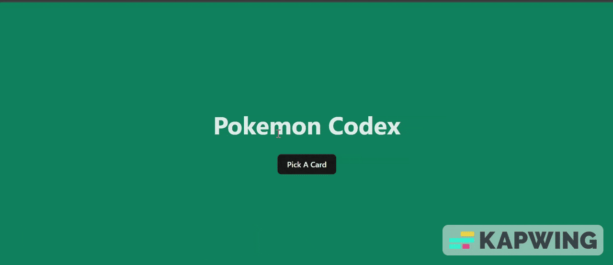

# Pokemon Website

A simple Pokémon website that fetches data from an API and displays it on the screen.

This is a simple project to practice my knowledge of asynchronous functions, manipulating strings, and useEffect for page rendering.

## Video Walkthrough

